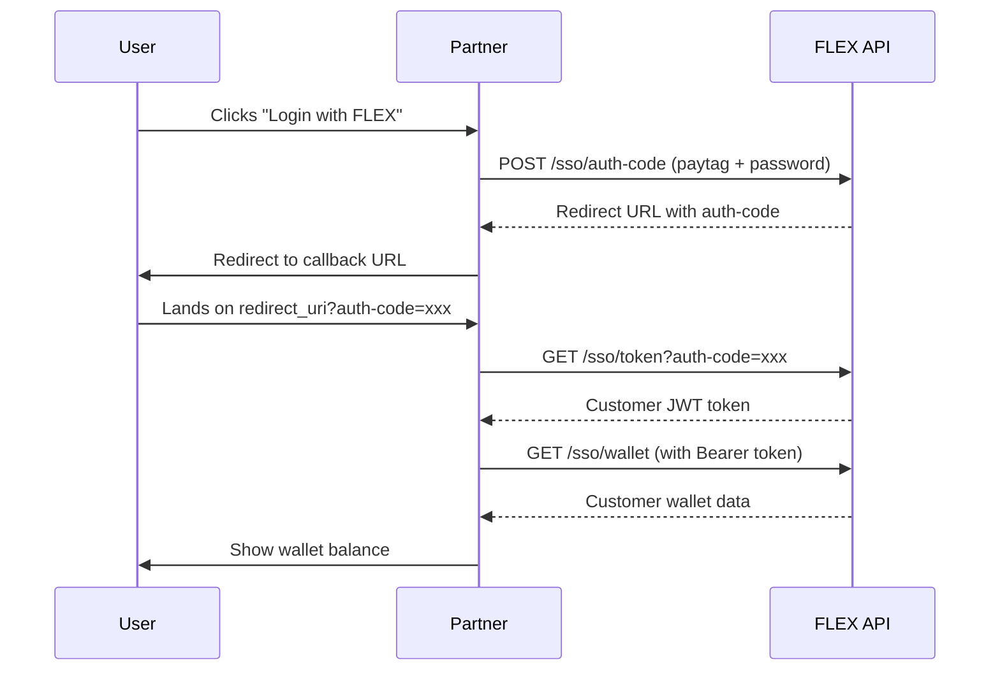

## Welcome to FLEX SSO API

The FLEX SSO API enables institutions and partners to create PayTags for their customers on the FLEX ecosystem. Your customers can then transact with any other PayTag user across the entire FLEX network, regardless of which partner they come from—creating a truly interconnected payment ecosystem.

## What You Can Do

<CardGroup cols={2}>
  <Card title="PayTag Creation" icon="user-plus">
    Create PayTags for your customers with BVN validation
  </Card>
  <Card title="Wallet Management" icon="wallet">
    Access partner-scoped wallets and transaction history
  </Card>
  <Card title="Cross-Partner Transactions" icon="money-bill-transfer">
    Enable P2P transfers, withdrawals, and payments across the entire FLEX ecosystem
  </Card>
  <Card title="Payment Requests" icon="file-invoice">
    Create and manage payment requests with any PayTag user
  </Card>
</CardGroup>

## Key Features

### 🌐 Cross-Partner Ecosystem
Your customers can transact with any PayTag user on FLEX, regardless of which institution created their PayTag.

### 🔐 Partner-Scoped Wallets
Each partner gets isolated wallet instances for their customers, ensuring data privacy and separation while enabling ecosystem-wide transactions.

### ✅ OAuth 2.0 Flow
Industry-standard authorization code flow for secure customer authentication.

### 🎯 Complete Wallet Experience
Full-featured wallet API including balances, limits, virtual accounts, and statements.

### 📱 PayTag System
User-friendly payment addresses (e.g., `@johndoe`) that work across the entire FLEX ecosystem for seamless peer-to-peer transfers.

## Base URLs

<CodeGroup>
```bash Staging
https://staging-api.yourflexpay.com/v2
```

```bash Production
https://api.yourflexpay.com/v2
```
</CodeGroup>

## API Sections

<CardGroup cols={2}>
  <Card title="Authentication" icon="key" href="/sso/authentication">
    OAuth flow, PayTag creation, and BVN verification
  </Card>
  <Card title="Wallet" icon="wallet" href="/sso/wallet">
    Balance, history, limits, and virtual accounts
  </Card>
  <Card title="Transactions" icon="exchange" href="/sso/transactions">
    P2P, withdrawals, bank transfers, and statements
  </Card>
  <Card title="Payment Requests" icon="file-invoice" href="/sso/payment-requests">
    Create, accept, decline, and cancel payment requests
  </Card>
  <Card title="PayTag" icon="at" href="/sso/api-paytag">
    Search and resolve PayTag profiles
  </Card>
  <Card title="Beneficiaries" icon="users" href="/sso/beneficiaries">
    Save and manage frequent recipients
  </Card>
</CardGroup>

## Authentication Types

The SSO API uses two authentication modes:

<AccordionGroup>
  <Accordion title="Partner Authentication (for PayTag creation)">
    Required headers:
    - `x-client-id`: Your partner ID
    - `x-api-key`: Your API key

    Used for creating PayTags and OAuth flow initiation.
  </Accordion>

  <Accordion title="Customer Authentication (for wallet operations)">
    Required headers:
    - `x-client-id`: Your partner ID
    - `x-api-key`: Your API key
    - `Authorization: Bearer {customer_token}`

    Used for all wallet and transaction operations on behalf of the customer. Enables transactions with any PayTag across the FLEX ecosystem.
  </Accordion>
</AccordionGroup>

## Quick Start

<Steps>
  <Step title="Get Partner Credentials">
    Contact FLEX support to receive:
    - Partner Client ID (`x-client-id`)
    - Partner API Key (`x-api-key`)
    - Redirect URLs for OAuth flow
  </Step>

  <Step title="Implement OAuth Flow">
    Follow the [authentication guide](/sso/authentication) to implement customer login
  </Step>

  <Step title="Create PayTags for Customers">
    Use the [PayTag creation flow](/sso/paytag-creation) to create PayTags on the FLEX ecosystem
  </Step>

  <Step title="Build Wallet Features">
    Complete the [integration guide](/sso/integration-guide) to enable cross-partner transactions
  </Step>
</Steps>

## Integration Flow



## Support

Need help? Reach out to our developer support team:

- **Email**: developers@yourflexpay.com

## API Status Codes

| Status Code | Description |
|------------|-------------|
| `200` | Success |
| `204` | No Content (successful async operation) |
| `400` | Bad Request - Invalid parameters |
| `401` | Unauthorized - Invalid credentials or expired token |
| `404` | Not Found - Resource doesn't exist |
| `500` | Server Error - Contact support |

## Next Steps

<CardGroup cols={2}>
  <Card title="Authentication Guide" icon="shield-halved" href="/sso/authentication">
    Learn the OAuth 2.0 flow
  </Card>
  <Card title="PayTag Creation" icon="user-plus" href="/sso/paytag-creation">
    Create PayTags for your customers
  </Card>
  <Card title="Integration Guide" icon="code" href="/sso/integration-guide">
    Enable cross-partner transactions
  </Card>
  <Card title="API Reference" icon="book" href="/sso/authentication">
    Explore all endpoints
  </Card>
</CardGroup>

